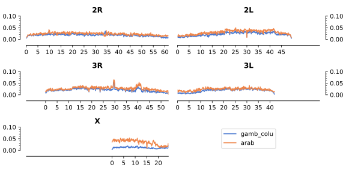

[@my-phase1]: doi:10.1038/nature24995
[@my-phase2]: doi:10.1101/gr.262790.120
[@my-16genomes]: doi:10.1126/science.1258522
[@my-clarkson-introgression]: pubmed:24963649 
[@my-lee-introgression]: doi:10.1073/pnas.1316851110
[@my-neafsey-aim]: pubmed:20966254

## Population Sampling

The third and final phase of the Ag1000g project data resource contains wild-caught _Anopheles_ mosquito genomes from Sub-Saharan Africa, collected from a total of 124 sites across 19 countries, 6 of which are novel.

Collections from Mali increase the density of coverage in West Africa, Central African Republic and Democratic Republic of Congo begin to fill the gap previously present in Central Africa while Malawi, Mozambique and Tanzania provide much more power to analyse East African malaria vectors, including _A. arabiensis_ an important vector species not previously sequenced in the project.

Alongside sampling from natural populations, we include colony individuals from a number of laboratory crosses, comprising 11 crosses that were released as part of phase 2, and 4 additional pedigrees.

{#fig:sample_collection_map width="100%"}

## Whole Genome Sequencing and Alignment {.page_break_before}

4,693 individual mosquito genomes were sequenced on either Illumina HiSeq2000 (n=3,130) or Illumina HiSeqX (n=1,563) to a target coverage of 30X.

Between machine types the median number of bases sequenced per sample was 9.76Gb and 10.33Gb respectively, representing a difference in yield (two-tailed mann-whitney U p < 0.0001).

These values correspond to a yield per reference base (vs AgamP4) of 35.76X and 37.82X. 

91.9% of HiSeqX runs and 80.5% of HiSeq2000 runs met the target yield of 30X.

Reads were aligned to the AgamP4 reference and Single Nucleotide Polymophisms (SNPs) called using GATK UnifiedGenotyper.

All samples successfully completed the pipeline and entered the sample quality control (QC) process.

### Sample QC

For wild-caught samples (n=3964), the QC process was composed of three stages, 
sequence quality assurance, replicate handling, and anomaly detection.
A total of 642 samples were removed where sequencing was of insufficient quality 
to accurately call genotypes across the whole genome.
Exclusions were due to poor coverage (n=398), potential contamination (n=219), 
and an ambiguous sex call (n=25).
Where technical replicates were available, we excluded 4 pairs (8 samples) with low genotype concordance. 
Where pairs met the concordance threshold we excluded the lower quality sample (n=403).
Samples were also screened pairwise within submission sets for unexpected pairs, though none were detected.
The third QC stage used principal component analysis (PCA) 
to identify and exclude individual samples that were outliers based on available metadata.
A review process identified samples that could not be explained parsimoniously, 
and were therefore likely to be sample mix ups or instances of mislabelling.
28 samples were excluded as they respectively dominated the first principal components, 
indicating high divergence from all other samples and therefore likely members of other Anopheline species.
A further 82 samples were excluded as potential sample mix ups.
Following all sample QC steps, 2,784 wild-caught samples (70.2%) were retained for analysis.

The AG1000G-X submission set, made up of experimental laboratory crosses, 
was subject to a slightly different QC process.
Firstly an analysis based on rates of Mendelian error identified true fathers of crosses 
(where multiple males were introduced to cages), and validated provided pedigrees.
Of the 729 samples sequenced we were able to validate 15 independent crosses to a high level of confidence, comprising 299 samples.
4 of these crosses are novel relative to phase 2.
These samples went through a modified sequence quality assurance process, 
a single sample was removed for potential contamination (methods).

The final data release therefore comprises 3,081 samples, 297 from laboratory crosses, and 2,784 wild collected samples.

This represents an increase of 1,939 mosquitoes relative to the phase 2 release.
9 biological samples included in phase 2 fail the updated sample QC process in phase 3.
Due to a change in assessment of sample quality where technical replicates are available,
_i.e_ looking at mean/median skew rather than taking the sample with the greatest coverage,
the preferred replicate was changed for 172 mosquitoes between phase 2 and phase 3.

### Coverage

%% TO DO
%% (PLOTS DONE, but numbers needed).

Summary of site coverage post QC exclusions.

- ie what frac of the genome is at 1X median
- what frac at 10X. 
- What frac of exome
- what frac of X

At this point we do not mention arabiensis.

### Species assignment and sex calling

The _Anopheles gambiae_ complex is a crypic group of sibling species,
with no single locus offering unambiguous resolution of species.
To identify species we looked beyond the conventional set of PCR based markers
and applied a wider set of ancestry informative markers (AIMs).
Species were not assigned to samples from laboratory colony crosses
due to inbreeding and high levels of genetic drift.
To distinguish _A. arabiensis_ from _A. gambiae s.l_ a set of novel markers 
was derived from data from the 16 genomes project [@my-16genomes].
Using cut offs based on agreement with the established PCR marker, 
368 individuals were classed as _A. arabiensis_ and 2415 as _A. gambiae s.l_. 
A single individual collected in Tororo, Uganda is classed as intermediate-
given the majority (93.9%) of AIM SNPs in the genome are heterozygous between 
the gambiae-like and arabiensis-like alleles, this individual is likely to be an F1 hybrid.
To resolve the _A. gambiae s.l_ individuals as _A. gambiae_ and _A. coluzzii_ 
we applied 729 AIMs previously identified by Neafsey et al [@my-neafsey-aim].
and used in previous analyses of Ag1000G data [@my-phase1;@my-phase2].
Of the 2,415  _A. gambiae s.l_ individuals, 
1571 were called as _A. gambiae s.s_, 675 as _A. coluzzii_ and 169 as intermediate.
Many intermediate samples are from the Western coast of West Africa (particularly The Gambia and Guinea Bissau),
and given distinct populations of _A. gambiae s.l._ and _A. coluzzii_ are also found in this region, 
this result highlights the complexity of species relationships here.
Additionally a number of samples were classed as intermediate in coastal populations of East Africa, 
in Kilifi Kenya, and Muleba Tanzania.

It is established that species barriers between members of the _An. gambiae_ complex are porous,
and numerous instances of introgression associated with selection have been observed in West Africa, 
particularly of the _kdr_ allele [@my-clarkson-introgression;@my-lee-introgression].
In West African coluzzii populations (2011 onwards), 
frequency of gambiae-like alleles around this locus reach 90%, 
_e.g._ Burkina Faso, Cote d'Ivoire, Cameroon, Ghana, Guinea and Mali.
In Southern Africa, _An. coluzzii_ from Luanda, Angola (2009) 
also show high frequency of gambiae alleles at this locus (83.9%).
However no introgression is observed in _coluzzii_ collections prior to this; 
Cameroon (2005, n=7), Mali (2004, n=36) and the Central African Republic (1993/4, n=18) 
all have gambiae alleles present at rates below 1%.
Due to this known introgression, chromosome 2L was not considered when assigning species within _An. gambiae s.l._.

### Site filtering and SNP quality

Features of specific regions of the _Anopheles_ genome may contribute to SNP calling errors in short-read technologies; 
such features include regions of high divergence from the reference, 
high homology between regions, copy number variation, or the presence of transposable elements.
Site filtering is necessary to ensure that reported variation is of the highest possible quality.
As genomic features vary between species, different sets of site filters were generated 
to allow high quality analyses both within and between species. 
The `gamb_colu` site filters are appropriate for analyses that include _gambiae_ and _coluzzii_ samples only.
The `arab` site filters were generated following application of the below model to 
summary statistics generated from arabiensis samples in the cohort (n=368), 
this set of site filters are appropriate when working with _A. arabiensis_ samples only.
Finally, the `gamb_colu_arab` site filters allow analyses across all three species 
and are the intersection of the `gamb_colu` and the `arab` site filters.

Previously we have used manually curated cutoffs [@my-phase1;@my-phase2] to filter sites.
In this release, we use a classification based approach, using a decision tree, 
resulting in a significantly improved set of site filters. 
Using the 15 available Anopheles pedigrees previously described, 
we used the presence of mendelian error at sites as a proxy for genotype discordance.
The inputs to the model were cohort level summary statistics of alignments and variant calls.
As all pedigrees were _Anopheles gambiae s.l._, _Anopheles gambiae_ and 
_coluzzii_  samples only were included to generate input variables, 
and therefore the `gamb_colu` site filters.
10 of the 15 crosses were used to train the model while 5 were held out for validation.
Each of these 5 pedigrees represent independent evaluation sets.

Before applying the site filters, the false discovery rate (FDR) of the 5 crosses 
over all autosomal sites ranged between 0.74% and 1.10%.
The application of the site filters defines the accessible fraction of the autosomes at 72.58%, 
and the range of false discovery rates is 0.04% to 0.10%.
This represents a significant reduction in FDR, by a median factor of 13.1, 
at a cost of defining 27.42% of the autosomal genome inaccessible (Table 1).

On the hemizygous X chromosome we used the more direct measure of heterozygote 
calls in males to ascertain mendelian error.
The 220 _Anopheles gambiae s.l._ male samples in the data release each form 
an independent proxy for genotype discordance.

Before application of the site filters, given a Genotype Quality (GQ) threshold of 30, 
the median heterozygosity rate was 0.244%; post filtering this drops to 0.023%.
The median factor reduction in heterozygosity rate was 10.1, 
with 69.97% of the X chromosome passing site filters.

The decision tree based method represents a marked improvement over the site filters used in phase 2.
On the autosomes all 5 evaluation pedigrees showed a modest reduction in FDR, 
and the higher rate of accessibility in this release (72.58% vs 62.05%) 
resulted in an substantial improvement in the Youden J statistic (Table 3).

The X chromosome showed a similar pattern, 
simultaneously reducing the median heterozygosity rate from 0.028% in phase 2 to 0.023% in phase 3,
and increasing accessibility from 62.46% to 69.97% (Table 3).

### Genome accessibility

We define accessibility as the fraction of sites in a region passing the appropriate set of site filters.
Overall, 72.3% of the genome, and 87.8% of the exome are considered accessible in the `gamb_colu` set.
This is an improvement from phase 2, where 62.1% of the genome, and 86.6% of the exome was considered accessible.
As expected, accessiblity was generally lower around the centromeres, and in regions of heterochromatin (Table 4).
One notable region of low accessibility spans 39.0 - 41.8Mbp of chromosome 3R, 
this corresponds to a large region of intercalary heterochromatin [@pubmed:20684766].

On the autosomes accessibility of the `arab` site filters closely follows that of `gamb_colu` (Table 5),
on the X chromosome however we see substantially lower accessibilty.
This appears to be due to high divergence between AgamP4 and our _A. arabiensis_ samples, 
likely driven by the Xag inversion from 0 - 15.0Mbp [@pubmed:25431491].

{#fig:gw_accessibility width="100%"}
{#fig:gw_divergence width="100%"}

On the autosomes the divergence from the reference is comparable between _A.arabiensis_ and _A. gambiae_/ _A. coluzzii_ samples, 
suggesting a strong basis for comparison across species.
The median divergence (Dxy) of 100kbp windows is 0.0202 (5%/95% 0.0077/0.0305) for gambiae/coluzzii and 0.0254 (0.0144/0.0395) for arabiensis.  
On the X chromosome these values are 0.0116 (0.0071/0.0166) for gambiae/coluzzii and 0.0385 (0.0149/0.0485) for arabiensis.

### SNP discovery

Overall, given the all-species site filters, we report XX,XXX,SSS single nucleotide polymophisms (SNPs) segregating in this cohort, of which XX,XXX (%) are multiallelic.
12,223 SNPs are segregating in both species groups, while XXX are private to gambiae_/coluzzii_ and YYY to arabiensis [fig ref].
This phase of the study therefore reports an additional XXX SNPs from phase 2.

In 2,415 _Anopheles gambiae/coluzzii_ individuals, and the corresponding `gamb_colu` site filters we observe 12,222,222 SNPs (Q% multiallelic), corresponding to a SNP every 1.6 accessible bases.
In 368 arabiensis individuals we identify 10,000,000 SNPs passing the `arab` site filters (Q% multiallelic), a SNP every 2.5 accessible bases.

## Population Structure

### Genome wide patterns

%% TODO NOtes currently.

Re-introduce key idea of structure being different across the genome. 

How does arabiensis fit into this? Are there regions of the genome where arabiensis ancestry is secondary?

### PCA / UMAP

To highlight population structure we performed principal component analysis across all wild-caught samples in the dataset.

To avoid confounding of structure in genomic regions including paracentric inversions, extremely low diversity and regions under strong selection, we limited our analysis to euchromatic regions of chromosome 3L. 

The most apparent signal in the dataset is PC1 clearly being driven by Arabiensis, with clear separation of arabiensis samples from gambiae/coluzzii. 

The apparent hybrid sits between gambiae and arabiensis samples.

To view population structure within gambiae/coluzzii and arabiensis more independently, we performed subsequent PCA analysis Arabiensis and gambiae/coluzzii individuals separately. 

Population structure between gambiae and coluzzii is significantly more complex. 

Separately between species. What are the major findings?

- Arabiensis drives PC1. 

- East Africa: Seems to be clear population structure between _gambiae_ in KE and TZ.

- According to AIM analysis, a significant proportion of samples in these groups are classed as IM between gambiae. Certainly not coluzzii, but some kind of complex ancestry. 

- Relevance to TENEGLRA

- West Africa- in far west Africa we see intermediate population. Not gambiae coluzzii, unlikely to be hybrids, but a related subspecies. 

Interestingly seems to be stable in the presence of both gamb and colu. Although they sit close to col in the PCA they are distinct from coluzzii, given they are founf at the same site.

### Genetic Diversity within sampling sites

Better to avoid use of population.

Using species groupings above, i.e. PCA clusters of samples not clearly gambcolu, but sympatric with them are classed as intermediate. 

First look at diversity at a regional level within species. ie gambiae is more diverse in west than east africa. Central?

Coluzzii is similar within its range. 

Arabiensis only found in EA, but do we see differences in diversity?

Justification of using wattersons theta.

THEN, we can start to speak about differences between species, within regions. 

West African gambiae have higher diversity than coluzzii. 

Then how do west african intermediate compare to these?

In east africa, we compare gambiae to arabiensis. 

## Insecticide Resistance

- kdr frequencies in different sampling groups
- we don't have CNVs... so? We can use markers?

## Gene Drive

- repeat of phase 2 analysis.

