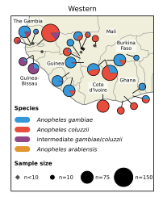
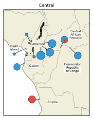
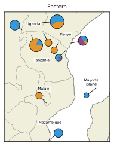

## figure demo {.page_break_before}

::: {#fig:figure-demo}

**Figure {@fig:figure-demo}{nolink=True}**

<table>
<tr>

<td style="border: none">

**a**

  
</td>
<td style="border: none">

**b**

</td>

<td style="border: none">

**c**

</td>

</tr>
</table>

:::