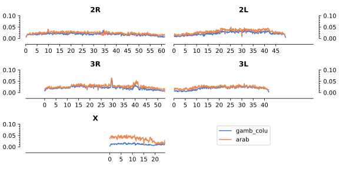

---
author-meta:
- The Anopheles gambiae 1000 Genomes Consortium
bibliography:
- content/manual-references.json
date-meta: '2021-03-25'
header-includes: '<!--

  Manubot generated metadata rendered from header-includes-template.html.

  Suggest improvements at https://github.com/manubot/manubot/blob/master/manubot/process/header-includes-template.html

  -->

  <meta name="dc.format" content="text/html" />

  <meta name="dc.title" content="Genome variation and population structure in three African malaria vector species within the *Anopheles gambiae* complex" />

  <meta name="citation_title" content="Genome variation and population structure in three African malaria vector species within the *Anopheles gambiae* complex" />

  <meta property="og:title" content="Genome variation and population structure in three African malaria vector species within the *Anopheles gambiae* complex" />

  <meta property="twitter:title" content="Genome variation and population structure in three African malaria vector species within the *Anopheles gambiae* complex" />

  <meta name="dc.date" content="2021-03-25" />

  <meta name="citation_publication_date" content="2021-03-25" />

  <meta name="dc.language" content="en-GB" />

  <meta name="citation_language" content="en-GB" />

  <meta name="dc.relation.ispartof" content="Manubot" />

  <meta name="dc.publisher" content="Manubot" />

  <meta name="citation_journal_title" content="Manubot" />

  <meta name="citation_technical_report_institution" content="Manubot" />

  <meta name="citation_author" content="The Anopheles gambiae 1000 Genomes Consortium" />

  <link rel="canonical" href="https://malariagen.github.io/ag1000g-phase3-data-paper/" />

  <meta property="og:url" content="https://malariagen.github.io/ag1000g-phase3-data-paper/" />

  <meta property="twitter:url" content="https://malariagen.github.io/ag1000g-phase3-data-paper/" />

  <meta name="citation_fulltext_html_url" content="https://malariagen.github.io/ag1000g-phase3-data-paper/" />

  <meta name="citation_pdf_url" content="https://malariagen.github.io/ag1000g-phase3-data-paper/manuscript.pdf" />

  <link rel="alternate" type="application/pdf" href="https://malariagen.github.io/ag1000g-phase3-data-paper/manuscript.pdf" />

  <link rel="alternate" type="text/html" href="https://malariagen.github.io/ag1000g-phase3-data-paper/v/9e4aa2d7a6949177e16d111070e979084e8308fc/" />

  <meta name="manubot_html_url_versioned" content="https://malariagen.github.io/ag1000g-phase3-data-paper/v/9e4aa2d7a6949177e16d111070e979084e8308fc/" />

  <meta name="manubot_pdf_url_versioned" content="https://malariagen.github.io/ag1000g-phase3-data-paper/v/9e4aa2d7a6949177e16d111070e979084e8308fc/manuscript.pdf" />

  <meta property="og:type" content="article" />

  <meta property="twitter:card" content="summary_large_image" />

  <link rel="icon" type="image/png" sizes="192x192" href="https://manubot.org/favicon-192x192.png" />

  <link rel="mask-icon" href="https://manubot.org/safari-pinned-tab.svg" color="#ad1457" />

  <meta name="theme-color" content="#ad1457" />

  <!-- end Manubot generated metadata -->'
keywords:
- malaria
- anopheles
- genomics
lang: en-GB
manubot-clear-requests-cache: false
manubot-output-bibliography: output/references.json
manubot-output-citekeys: output/citations.tsv
manubot-requests-cache-path: ci/cache/requests-cache
title: Genome variation and population structure in three African malaria vector species within the *Anopheles gambiae* complex
...

<small><em>
This manuscript
([permalink](https://malariagen.github.io/ag1000g-phase3-data-paper/v/9e4aa2d7a6949177e16d111070e979084e8308fc/))
was automatically generated
from [malariagen/ag1000g-phase3-data-paper@9e4aa2d](https://github.com/malariagen/ag1000g-phase3-data-paper/tree/9e4aa2d7a6949177e16d111070e979084e8308fc)
on March 25, 2021.
</em></small>

## Authors

+ **The Anopheles gambiae 1000 Genomes Consortium**  
  <small>
  </small>

## Abstract {.page_break_before}

[@my-phase1]: doi:10.1038/nature24995
[@my-phase2]: doi:10.1101/gr.262790.120
[@my-16genomes]: doi:10.1126/science.1258522
[@my-clarkson-introgression]: pubmed:24963649 
[@my-lee-introgression]: doi:10.1073/pnas.1316851110
[@my-neafsey-aim]: pubmed:20966254

## Population Sampling

The third and final phase of the Ag1000g project data resource contains wild-caught _Anopheles_ mosquito genomes from Sub-Saharan Africa, collected from a total of 124 sites across 19 countries, 6 of which are novel.

Collections from Mali increase the density of coverage in West Africa, Central African Republic and Democratic Republic of Congo begin to fill the gap previously present in Central Africa while Malawi, Mozambique and Tanzania provide much more power to analyse East African malaria vectors, including _A. arabiensis_ an important vector species not previously sequenced in the project.

Alongside sampling from natural populations, we include colony individuals from a number of laboratory crosses, comprising 11 crosses that were released as part of phase 2, and 4 additional pedigrees.

{#fig:sample_collection_map width="100%"}

## Whole Genome Sequencing and Alignment {.page_break_before}

4,693 individual mosquito genomes were sequenced on either Illumina HiSeq2000 (n=3,130) or Illumina HiSeqX (n=1,563) to a target coverage of 30X.

Between machine types the median number of bases sequenced per sample was 9.76Gb and 10.33Gb respectively, representing a difference in yield (two-tailed mann-whitney U p < 0.0001).

These values correspond to a yield per reference base (vs AgamP4) of 35.76X and 37.82X. 

91.9% of HiSeqX runs and 80.5% of HiSeq2000 runs met the target yield of 30X.

Reads were aligned to the AgamP4 reference and Single Nucleotide Polymophisms (SNPs) called using GATK UnifiedGenotyper.

All samples successfully completed the pipeline and entered the sample quality control (QC) process.

### Sample QC

For wild-caught samples (n=3964), the QC process was composed of three stages, 
sequence quality assurance, replicate handling, and anomaly detection.
A total of 642 samples were removed where sequencing was of insufficient quality 
to accurately call genotypes across the whole genome.
Exclusions were due to poor coverage (n=398), potential contamination (n=219), 
and an ambiguous sex call (n=25).
Where technical replicates were available, we excluded 4 pairs (8 samples) with low genotype concordance. 
Where pairs met the concordance threshold we excluded the lower quality sample (n=403).
Samples were also screened pairwise within submission sets for unexpected pairs, though none were detected.
The third QC stage used principal component analysis (PCA) 
to identify and exclude individual samples that were outliers based on available metadata.
A review process identified samples that could not be explained parsimoniously, 
and were therefore likely to be sample mix ups or instances of mislabelling.
28 samples were excluded as they respectively dominated the first principal components, 
indicating high divergence from all other samples and therefore likely members of other Anopheline species.
A further 82 samples were excluded as potential sample mix ups.
Following all sample QC steps, 2,784 wild-caught samples (70.2%) were retained for analysis.

The AG1000G-X submission set, made up of experimental laboratory crosses, 
was subject to a slightly different QC process.
Firstly an analysis based on rates of Mendelian error identified true fathers of crosses 
(where multiple males were introduced to cages), and validated provided pedigrees.
Of the 729 samples sequenced we were able to validate 15 independent crosses to a high level of confidence, comprising 299 samples.
4 of these crosses are novel relative to phase 2.
These samples went through a modified sequence quality assurance process, 
a single sample was removed for potential contamination (methods).

The final data release therefore comprises 3,081 samples, 297 from laboratory crosses, and 2,784 wild collected samples.

This represents an increase of 1,939 mosquitoes relative to the phase 2 release.
9 biological samples included in phase 2 fail the updated sample QC process in phase 3.
Due to a change in assessment of sample quality where technical replicates are available,
_i.e_ looking at mean/median skew rather than taking the sample with the greatest coverage,
the preferred replicate was changed for 172 mosquitoes between phase 2 and phase 3.

### Coverage

%% TO DO
%% (PLOTS DONE, but numbers needed).

Summary of site coverage post QC exclusions.

- ie what frac of the genome is at 1X median
- what frac at 10X. 
- What frac of exome
- what frac of X

At this point we do not mention arabiensis.

### Species assignment and sex calling

The _Anopheles gambiae_ complex is a crypic group of sibling species,
with no single locus offering unambiguous resolution of species.
To identify species we looked beyond the conventional set of PCR based markers
and applied a wider set of ancestry informative markers (AIMs).
Species were not assigned to samples from laboratory colony crosses
due to inbreeding and high levels of genetic drift.
To distinguish _A. arabiensis_ from _A. gambiae s.l_ a set of novel markers 
was derived from data from the 16 genomes project [@my-16genomes].
Using cut offs based on agreement with the established PCR marker, 
368 individuals were classed as _A. arabiensis_ and 2415 as _A. gambiae s.l_. 
A single individual collected in Tororo, Uganda is classed as intermediate-
given the majority (93.9%) of AIM SNPs in the genome are heterozygous between 
the gambiae-like and arabiensis-like alleles, this individual is likely to be an F1 hybrid.
To resolve the _A. gambiae s.l_ individuals as _A. gambiae_ and _A. coluzzii_ 
we applied 729 AIMs previously identified by Neafsey et al [@my-neafsey-aim].
and used in previous analyses of Ag1000G data [@my-phase1;@my-phase2].
Of the 2,415  _A. gambiae s.l_ individuals, 
1571 were called as _A. gambiae s.s_, 675 as _A. coluzzii_ and 169 as intermediate.
Many intermediate samples are from the Western coast of West Africa (particularly The Gambia and Guinea Bissau),
and given distinct populations of _A. gambiae s.l._ and _A. coluzzii_ are also found in this region, 
this result highlights the complexity of species relationships here.
Additionally a number of samples were classed as intermediate in coastal populations of East Africa, 
in Kilifi Kenya, and Muleba Tanzania.

It is established that species barriers between members of the _An. gambiae_ complex are porous,
and numerous instances of introgression associated with selection have been observed in West Africa, 
particularly of the _kdr_ allele [@my-clarkson-introgression;@my-lee-introgression].
In West African coluzzii populations (2011 onwards), 
frequency of gambiae-like alleles around this locus reach 90%, 
_e.g._ Burkina Faso, Cote d'Ivoire, Cameroon, Ghana, Guinea and Mali.
In Southern Africa, _An. coluzzii_ from Luanda, Angola (2009) 
also show high frequency of gambiae alleles at this locus (83.9%).
However no introgression is observed in _coluzzii_ collections prior to this; 
Cameroon (2005, n=7), Mali (2004, n=36) and the Central African Republic (1993/4, n=18) 
all have gambiae alleles present at rates below 1%.
Due to this known introgression, chromosome 2L was not considered when assigning species within _An. gambiae s.l._.

### Site filtering and SNP quality

Features of specific regions of the _Anopheles_ genome may contribute to SNP calling errors in short-read technologies; 
such features include regions of high divergence from the reference, 
high homology between regions, copy number variation, or the presence of transposable elements.
Site filtering is necessary to ensure that reported variation is of the highest possible quality.
As genomic features vary between species, different sets of site filters were generated 
to allow high quality analyses both within and between species. 
The `gamb_colu` site filters are appropriate for analyses that include _gambiae_ and _coluzzii_ samples only.
The `arab` site filters were generated following application of the below model to 
summary statistics generated from arabiensis samples in the cohort (n=368), 
this set of site filters are appropriate when working with _A. arabiensis_ samples only.
Finally, the `gamb_colu_arab` site filters allow analyses across all three species 
and are the intersection of the `gamb_colu` and the `arab` site filters.

Previously we have used manually curated cutoffs [@my-phase1;@my-phase2] to filter sites.
In this release, we use a classification based approach, using a decision tree, 
resulting in a significantly improved set of site filters. 
Using the 15 available Anopheles pedigrees previously described, 
we used the presence of mendelian error at sites as a proxy for genotype discordance.
The inputs to the model were cohort level summary statistics of alignments and variant calls.
As all pedigrees were _Anopheles gambiae s.l._, _Anopheles gambiae_ and 
_coluzzii_  samples only were included to generate input variables, 
and therefore the `gamb_colu` site filters.
10 of the 15 crosses were used to train the model while 5 were held out for validation.
Each of these 5 pedigrees represent independent evaluation sets.

Before applying the site filters, the false discovery rate (FDR) of the 5 crosses 
over all autosomal sites ranged between 0.74% and 1.10%.
The application of the site filters defines the accessible fraction of the autosomes at 72.58%, 
and the range of false discovery rates is 0.04% to 0.10%.
This represents a significant reduction in FDR, by a median factor of 13.1, 
at a cost of defining 27.42% of the autosomal genome inaccessible (Table 1).

On the hemizygous X chromosome we used the more direct measure of heterozygote 
calls in males to ascertain mendelian error.
The 220 _Anopheles gambiae s.l._ male samples in the data release each form 
an independent proxy for genotype discordance.

Before application of the site filters, given a Genotype Quality (GQ) threshold of 30, 
the median heterozygosity rate was 0.244%; post filtering this drops to 0.023%.
The median factor reduction in heterozygosity rate was 10.1, 
with 69.97% of the X chromosome passing site filters.

The decision tree based method represents a marked improvement over the site filters used in phase 2.
On the autosomes all 5 evaluation pedigrees showed a modest reduction in FDR, 
and the higher rate of accessibility in this release (72.58% vs 62.05%) 
resulted in an substantial improvement in the Youden J statistic (Table 3).

The X chromosome showed a similar pattern, 
simultaneously reducing the median heterozygosity rate from 0.028% in phase 2 to 0.023% in phase 3,
and increasing accessibility from 62.46% to 69.97% (Table 3).

### Genome accessibility

We define accessibility as the fraction of sites in a region passing the appropriate set of site filters.
Overall, 72.3% of the genome, and 87.8% of the exome are considered accessible in the `gamb_colu` set.
This is an improvement from phase 2, where 62.1% of the genome, and 86.6% of the exome was considered accessible.
As expected, accessiblity was generally lower around the centromeres, and in regions of heterochromatin (Table 4).
One notable region of low accessibility spans 39.0 - 41.8Mbp of chromosome 3R, 
this corresponds to a large region of intercalary heterochromatin [@pubmed:20684766].

On the autosomes accessibility of the `arab` site filters closely follows that of `gamb_colu` (Table 5),
on the X chromosome however we see substantially lower accessibilty.
This appears to be due to high divergence between AgamP4 and our _A. arabiensis_ samples, 
likely driven by the Xag inversion from 0 - 15.0Mbp [@pubmed:25431491].

{#fig:gw_accessibility width="100%"}
{#fig:gw_divergence width="100%"}

On the autosomes the divergence from the reference is comparable between _A.arabiensis_ and _A. gambiae_/ _A. coluzzii_ samples, 
suggesting a strong basis for comparison across species.
The median divergence (Dxy) of 100kbp windows is 0.0202 (5%/95% 0.0077/0.0305) for gambiae/coluzzii and 0.0254 (0.0144/0.0395) for arabiensis.  
On the X chromosome these values are 0.0116 (0.0071/0.0166) for gambiae/coluzzii and 0.0385 (0.0149/0.0485) for arabiensis.

### SNP discovery

Overall, given the all-species site filters, we report XX,XXX,SSS single nucleotide polymophisms (SNPs) segregating in this cohort, of which XX,XXX (%) are multiallelic.
12,223 SNPs are segregating in both species groups, while XXX are private to gambiae_/coluzzii_ and YYY to arabiensis [fig ref].
This phase of the study therefore reports an additional XXX SNPs from phase 2.

In 2,415 _Anopheles gambiae/coluzzii_ individuals, and the corresponding `gamb_colu` site filters we observe 12,222,222 SNPs (Q% multiallelic), corresponding to a SNP every 1.6 accessible bases.
In 368 arabiensis individuals we identify 10,000,000 SNPs passing the `arab` site filters (Q% multiallelic), a SNP every 2.5 accessible bases.

## Population Structure

### Genome wide patterns

%% TODO NOtes currently.

Re-introduce key idea of structure being different across the genome. 

How does arabiensis fit into this? Are there regions of the genome where arabiensis ancestry is secondary?

### PCA / UMAP

To highlight population structure we performed principal component analysis across all wild-caught samples in the dataset.

To avoid confounding of structure in genomic regions including paracentric inversions, extremely low diversity and regions under strong selection, we limited our analysis to euchromatic regions of chromosome 3L. 

The most apparent signal in the dataset is PC1 clearly being driven by Arabiensis, with clear separation of arabiensis samples from gambiae/coluzzii. 

The apparent hybrid sits between gambiae and arabiensis samples.

To view population structure within gambiae/coluzzii and arabiensis more independently, we performed subsequent PCA analysis Arabiensis and gambiae/coluzzii individuals separately. 

Population structure between gambiae and coluzzii is significantly more complex. 

Separately between species. What are the major findings?

- Arabiensis drives PC1. 

- East Africa: Seems to be clear population structure between _gambiae_ in KE and TZ.

- According to AIM analysis, a significant proportion of samples in these groups are classed as IM between gambiae. Certainly not coluzzii, but some kind of complex ancestry. 

- Relevance to TENEGLRA

- West Africa- in far west Africa we see intermediate population. Not gambiae coluzzii, unlikely to be hybrids, but a related subspecies. 

Interestingly seems to be stable in the presence of both gamb and colu. Although they sit close to col in the PCA they are distinct from coluzzii, given they are founf at the same site.

### Genetic Diversity within sampling sites

Better to avoid use of population.

Using species groupings above, i.e. PCA clusters of samples not clearly gambcolu, but sympatric with them are classed as intermediate. 

First look at diversity at a regional level within species. ie gambiae is more diverse in west than east africa. Central?

Coluzzii is similar within its range. 

Arabiensis only found in EA, but do we see differences in diversity?

Justification of using wattersons theta.

THEN, we can start to speak about differences between species, within regions. 

West African gambiae have higher diversity than coluzzii. 

Then how do west african intermediate compare to these?

In east africa, we compare gambiae to arabiensis. 

## Insecticide Resistance

- kdr frequencies in different sampling groups
- we don't have CNVs... so? We can use markers?

## Gene Drive

- repeat of phase 2 analysis.

# Methods {.page_break_before}

[@my-fanello]: doi:10.1046/j.1365-2915.2002.00393.x 
[@my-coetzee]: pubmed:26131476
[@my-santolamazza]: pubmed:15210999
[@my-scott]: doi:10.4269/ajtmh.1993.49.520
[@my-white]: pubmed:17297045
[@my-pinto]: doi:10.1111/j.1365-2915.2006.00611.x
[@my-donnelly]: pubmed:10583542
[@my-vincente]: doi:10.1038/srep46451

## Population Sampling

### Summary

The Ag1000G project is coordinated by a consortium of partners from a range of different research institutions and countries.
This includes consortium members who are carrying out independent research studies in malaria endemic regions, and who have contributed mosquito specimens or mosquito DNA samples collected in the course of their own research.
The methods presented here describe the studies that have contributed samples to phase 3 of the Ag1000G project, including wild-caught samples from 19 African countries.
This section also provides information about the collection locations and methods, the people involved in the studies, and references to any published articles providing further information about the studies. 
Throughout this document we use species nomenclature following Coetzee _et al._ [@my-coetzee].
Unless otherwise stated, the DNA extraction method used for the collections described below was Qiagen DNeasy Blood and Tissue Kit (Qiagen Science, MD, USA).

### Angola {.page_break_before}

#### Sample sets

`AG1000G-AO`.

#### Study information

Adult mosquitoes were obtained by rearing larvae collected from breeding sites along the main roads connecting the municipalities of Kilamba-Kiaxi and Viana, Luanda province __[(-8.821,13.291)](https://www.openstreetmap.org/?mlat=-8.821&mlon=13.291&zoom=12&layers=M)__, in April/May 2009.
These are peri-urban areas where malaria reaches hyperendemic levels.
All specimens collected in the study area were typed as _A. coluzzii_ [@my-fanello] although _An. melas_ and _A. arabiensis_ have also been recorded in the province [@doi:10.1186/1475-2875-5-2;@doi:10.4269/ajtmh.2008.78.169].
Specimens were stored on silica gel and DNA extraction was performed by a phenol-chloroform protocol described in [@doi:10.1038/sj.hdy.6885930].

#### Contributors

  - Arlete D. Troco
    - Programa Nacional de Controle da Malária, Direcção Nacional de Saúde Pública, Ministério da Saúde, Luanda, Angola.
  - João Pinto (jpinto@ihmt.unl.pt)
    - Global Health and Tropical Medicine, GHTM, Instituto de Higiene e Medicina Tropical, IHMT, Universidade Nova de Lisboa, UNL, Rua da Junqueira 100, 1349-008 Lisbon, Portugal.

### Burkina Faso (1) {.page_break_before}

#### Sample sets

`AG1000G-BF-A`, `AG1000G-BF-B`

#### Study information

The Target Malaria project contributed samples from collections made in three villages separated by at most 30km: Bana __[(11.233, -4.472)](https://www.openstreetmap.org/?mlat=11.233&mlon=-4.472&zoom=12&layers=M)__, Souroukoudinga __[(11.235, -4.535)](https://www.openstreetmap.org/?mlat=11.235&mlon=-4.535&zoom=12&layers=M)__ and Pala __[(11.150, -4.235)](https://www.openstreetmap.org/?mlat=11.150&mlon=-4.235&zoom=12&layers=Mi)__. 
These collections were made in July-August 2012, July and October 2014, and January, February and April 2015.
The area is agricultural, with rice-growing areas near Bana and Souroukoudinga, and a large mango grove near Pala.
Female mosquitoes were collected by human landing catch, pyrethrum spray collection or aspiration. 
Males were collected by swarm netting. 
Both _An. gambiae_ and _An. coluzzii_ [@pubmed:17177993] were collected. 
Specimens were stored in 80% ethanol and DNA was extracted using the DNeasy Tissue Kit (Qiagen) or using a simple CTAB method.

#### External resources
  - __[https://targetmalaria.org/]([https://targetmalaria.org/)__

#### Contributors
  - Abdoulaye Diabaté
    - Institut de Recherche en Sciences de la Santé (IRSS), Bobo Dioulasso, B.P.545, Burkina Faso.
  - Patric Stephane Epopa
    - Institut de Recherche en Sciences de la Santé (IRSS), Bobo Dioulasso, B.P.545, Burkina Faso.
  - Franck Yao
    - Institut de Recherche en Sciences de la Santé (IRSS), Bobo Dioulasso, B.P.545, Burkina Faso.
  - Samantha O'Loughlin (s.oloughlin@imperial.ac.uk)
    - Department of Life Sciences, Imperial College, Silwood Park, Ascot, Berkshire SL5 7PY, UK.
  - Austin Burt
    - Department of Life Sciences, Imperial College, Silwood Park, Ascot, Berkshire SL5 7PY, UK.

#### Acknowledgements

We would like to thank the technicians of the Institute de Recherche en Sciences de la Santé/Target Malaria Burkina Faso, including Guel Hyacinthe, Diabate Brama, Ilboudo Seni, Kabre Rasmane, Diabate Noufou and Yeye Pascal, for their contributions to sample collections.

### Burkina Faso (2) {.page_break_before}

#### Sample sets
`AG1000G-BF-C`

#### Study information
Samples were contributed from collections of indoor resting adults made by spray catch from Monomtenga in central Burkina Faso __[(12.06, -1.17)](https://www.openstreetmap.org/?mlat=12.06&mlon=-1.17&zoom=12&layers=M)__. 
These specimens were sorted morphologically to __An. gambiae s.l.__. 
Ovaries of half-gravid females were dissected and placed in numbered individual micro-tubes containing modified Carnoy's solution (1:3 glacial acetic acid: 100% ethanol). 
Carcasses were placed in correspondingly numbered micro-tubes over desiccant.
Genomic DNA was isolated from individual mosquitoes using one of the following: DNeasy Extraction Kit (Qiagen, Valencia, CA), Puregene kit (Gentra Systems, Inc., Minneapolis, MN), DNAzol kit (Molecular Research Center, Inc., Cincinnati, OH.) or Easy-DNA kit (Invitrogen, Carlsbad, CA).
__An. gambiae s.s.__ and its molecular forms were identified using one of two rDNA-based PCR/RFLP assays, [@my-fanello;@my-santolamazza].
Ovaries from specimens of the desired species were subject to polytene chromosome analysis.

#### Contributors

  - Carlo Costantini (carlo.costantini@ird.fr)
    - UMR MIVEGEC, Univ. Montpellier, CNRS, IRD, Montpellier, France.
  - N'Fale Sagnon
    - Centre National de Recherche et Formation sur le Paludisme (CNRFP), 01BP 2208 Ouagadougou 01, Burkina Faso.
  - Nora J. Besansky (nbesansk@nd.edu)
    - Eck Institute for Global Health & Department of Biological Sciences, University of Notre Dame, IN 46556, USA.

### Cameroon (1) {.page_break_before}

#### Sample sets
`AG1000G-CM-A`

#### Study information

Pyrethrum spray collections were conducted in three villages in Cameroon during September and October 2009.
These villages comprise a transect from forest (village of Mayos: __[(4.341, 13.558)](https://www.openstreetmap.org/?mlat=4.341&mlon=13.558&zoom=12&layers=M))__ to forest/savanna transition (village of Daiguene: __[(4.777, 13.844)](https://www.openstreetmap.org/?mlat=4.777&mlon=13.844&zoom=12&layers=M))__ to savanna (villages of Gado-Badzere and Zembe-Borongo: __[(5.747, 14.442)](https://www.openstreetmap.org/?mlat=5.747&mlon=14.442&zoom=12&layers=M)__) (@doi:10.1186/1475-2875-9-293).
All contributed specimens were __An. gambiae s.s.__ [@my-fanello].
A proportion of specimens were karyotyped via scoring of polytene chromosomes [@doi:10.1186/s12936-016-1242-5].
Specimens were stored on silica gel, and DNA was extracted using a simple CTAB protocol and run over Qiagen columns.

#### Related publications

- NF Lobo et al. 2010. Breakpoint structure of the Anopheles gambiae 2Rb chromosomal inversion.  Malaria Journal. 9:293. (@doi:10.1186/1475-2875-9-293).

####  Contributors
  - Carlo Costantini (carlo.costantini@ird.fr)
    - UMR MIVEGEC, Univ. Montpellier, CNRS, IRD, Montpellier, France.
  - Kyanne R. Rohatgi
    - Eck Institute for Global Health & Department of Biological Sciences, University of Notre Dame, IN 46556, USA.
  - Nora J. Besansky (nbesansk@nd.edu)
    - Eck Institute for Global Health & Department of Biological Sciences, University of Notre Dame, IN 46556, USA.

### Cameroon (2) {.page_break_before}

#### Sample sets

`AG1000G-CM-B`

#### Study information
These samples were collected as part of a study which took place in Cameroon in Central Africa. 
The country is commonly referred to as "miniature Africa", owing to the diversity of its climate, topography, landscape,
and bio-ecological settings: arid savannas in the north gradually turn into rain forest in the south, 
along with highland areas, contribute to increase diversity of ecological settings.
Anopheline mosquitoes were collected in 2005 from 64 locations covering a 1,500 km north-to-south transect
that crossed all eco-geographical areas of Cameroon [@doi:10.1186/1472-6785-9-17]
Mosquito collection involved spraying aerosols of pyrethroid insecticides inside human dwellings, 
dead mosquitoes were retrieved from white sheets that were laid on the floor.
Anopheline mosquitoes were identified using morphological identification keys [@isbn:9780620103213;@gillies1968].
Ovaries from half-gravid An. gambiae s.l. females were dissected and stored in Carnoy's fixative solution
(absolute ethanol:glacial acetic acid 3:1) for cytogenetic analyses. 
Carcasses were stored individually in tubes containing a desiccant and kept at -20^o^ C 
until they were processed for molecular analysis. 
All half-gravid specimens collected in each village were identified to species and molecular forms using PCR-RFLP [@my-fanello].

#### Related publications

  - Simard, Frédéric, et al. “Ecological Niche Partitioning between Anopheles Gambiae Molecular Forms in Cameroon: The Ecological Side of Speciation.” BMC Ecology, vol. 9, no. 1, 2009, p. 17, 10.1186/1472-6785-9-17. [@doi:10.1186/1472-6785-9-17].

#### Contributors
  - Frédéric Simard (frederic.simard@ird.fr)
    - UMR MIVEGEC, Univ. Montpellier, CNRS, IRD, Montpellier, France.
  - Diego Ayala (diego.ayala@ird.fr)
    - UMR MIVEGEC, Univ. Montpellier, CNRS, IRD, Montpellier, France.
  - Nora J. Besansky (nbesansk@nd.edu)
    - Eck Institute for Global Health & Department of Biological Sciences, University of Notre Dame, IN 46556, USA.
  - Carlo Costantini (carlo.costantini@ird.fr)
    - UMR MIVEGEC, Univ. Montpellier, CNRS, IRD, Montpellier, France.

### Cameroon (3) {.page_break_before}

#### Sample sets

`AG1000G-CM-C`

#### Study information
Samples were contributed from pyrethrum spray collections, larval sampling and human landing catches conducted in twenty locations during October 2013.

These villages are scattered throughout the country and reflect a gradient of human-dominated environments, for example, forest (Manda: __[(5.726, 10.868)](https://www.openstreetmap.org/?mlat=5.726&mlon=10.868&zoom=12&layers=M)__ and Campo: __[(2.367, 9.817)](https://www.openstreetmap.org/?mlat=2.367&mlon=9.817&zoom=12&layers=M); forest/savanna transition (Tibati: __[(6.469, 12.629)](https://www.openstreetmap.org/?mlat=6.469&mlon=12.629&zoom=12&layers=M)__); savanna (Lagdo: __[(9.049, 13.656)](https://www.openstreetmap.org/?mlat=9.049&mlon=13.656&zoom=12&layers=M)); suburban area (Nkolondom: __[(3.972, 11.516)](https://www.openstreetmap.org/?mlat=3.972&mlon=11.516&zoom=12&layers=M)__) and urban areas (Douala: __[(4.055, 9.721)](https://www.openstreetmap.org/?mlat=4.055&mlon=9.721&zoom=12&layers=M)__ and Yaoundé: __[(3.880, 11.506)](https://www.openstreetmap.org/?mlat=3.880&mlon=11.506&zoom=12&layers=M)__. 

Contributed specimens were _An. gambiae_ or _An.coluzzii_ [@my-fanello].

Population genomics studies indicated the presence of relatively dierentiated subgroups within both species as well as clusters thriving in polluted breeding sites in large cities [@pubmed:28204524].

Specimens were stored on silica gel.

DNA was extracted using a Zymo research kit for adults, and a Qiagen kit for larvae.

#### Related publications

  - C Kamdem et al. 2017. Pollutants and Insecticides Drive Local Adaptation in African Malaria Mosquitoes. Molecular Biology and Evolution. 34: 1261-1275. [@pubmed:28204524].

#### Contributors

  - Colince Kamdem
    - Laboratoire de Recherche sur le Paludisme, Organisation de Coordination pour la lutte contre les Endémies en Afrique Centrale (OCEAC), B.P. 288, Yaoundé, Cameroon.
  - Caroline Fouet
    - Department of Entomology, University of California, Riverside, CA, USA.
  - Bradley J. White (bradwhite@verily.com)
    - Verily Life Sciences, South San Francisco, CA 94080, USA.

### Central African Republic {.page_break_before}

#### Sample sets

`AG1000G-CF`

#### Study information
Collections were carried out in Bangui __[(4.367, 18.583)](https://www.openstreetmap.org/?mlat=4.367&mlon=18.583&zoom=12&layers=M)__, during December 1993, by indoor
resting aspiration or pyrethrum spray catch.

#### Contributors

  - Alessandra della Torre (alessandra.dellatorre@uniroma1.it)
    - Istituto Pasteur Italia Fondazione Cenci Bolognetti, Dipartimento di Sanita Pubblica e Malattie Infettive, Università di Roma SAPIENZA, Rome, Italy.

### Bioko Island, Equatorial Guinea {.page_break_before}

#### Sample sets

`AG1000G-GQ`

#### Study information

Collections were performed during the rainy season in September 2002 by overnight CDC light traps in Sacriba of Bioko island __[(3.7, 8.7)](https://www.openstreetmap.org/?mlat=3.7&mlon=8.7&zoom=12&layers=M)__. 

Specimens were stored dry on silica gel before DNA extraction. 

Specimens contributed from this site were _An. gambiae_ females, genotype determined by two assays [@my-scott,@my-santolamazza].

All specimens had the 2L^+a^/2L^+a^ karyotype as determined by the molecular PCR diagnostics [@my-white].

These mosquitoes represent a population that inhabited Bioko Island before a comprehensive malaria control intervention initiated in February 2004 [@doi:10.1186/1475-2875-6-52].

After the intervention _An. gambiae_ was declining, and more recently almost only _An. coluzzii_ can be found [@doi:10.1186/1475-2875-11-56].

#### Contributors

  - Jorge Cano
    - London School of Hygiene and Tropical Medicine, Keppel Street, Bloomsbury, London WC1E 7HT, UK.
  - Maryam Kamali
    - Department of Medical Entomology and Parasitology, Faculty of Medical Sciences, Tarbiat Modares University, Tehran, Iran.
    - Department of Entomology, Virginia Tech, Blacksburg, Virginia 24061, USA.
  - Igor Sharakhov (igor@vt.edu)
    - Department of Entomology, Virginia Tech, Blacksburg, Virginia 24061, USA.
    - Department of Genetics and Cell Biology, Tomsk State University, Tomsk 634050, Russia.

### Côte d'Ivoire {.page_break_before}

#### Sample sets
`AG1000G-CI`

#### Study information
Samples were collected in Tiassale __[(5.898, -4.823)](https://www.openstreetmap.org/?mlat=5.898&mlon=-4.823&zoom=12&layers=M)__, located in the evergreen forest zone of southern Côte d'Ivoire. 
The primary agricultural activity is rice cultivation in irrigated fields.
High malaria transmission occurs during the rainy seasons, between May and November. 
Samples were collected as larvae from irrigated rice fields by dipping between May and September 2012. 
All larvae were reared to adults and females preserved over silica for DNA extraction. 
Specimens from this site were all _An. coluzzii_ , determined by PCR assay [@my-santolamazza].

#### Related publications

  - Grau-Bové, Xavier, et al. “Resistance to Pirimiphos-Methyl in West African Anopheles Is Spreading via Duplication and Introgression of the Ace1 Locus.” PLOS Genetics, vol. 17, no. 1, 21 Jan. 2021, p. e1009253, 10.1371/journal.pgen.1009253. Accessed 1 Feb. 2021. [@doi:10.1371/journal.pgen.1009253].

#### Contributors
  - David Weetman (david.weetman@lstmed.ac.uk)
    - Department of Vector Biology, Liverpool School of Tropical Medicine, Liverpool, United Kingdom.
  - Edi Constant
    - Centre Suisse de Recherches Scientifiques. Yopougon, Abidjan - 01 BP 1303 Abidjan, Côte d'Ivoire.

### Ghana {.page_break_before}

#### Sample sets

`AG1000G-GH`

#### Study information

Samples were collected in Twifo Praso __[(5.609,-1.549)](https://www.openstreetmap.org/?mlat=5.609&mlon=-1.549&zoom=12&layers=M)__, a peri-urban community located in semi-deciduous forest in the Central Region of Ghana.
It is an extensive agricultural area characterised by small-scale (vegetable growing) and large-scale commercial farms such as oil palm and cocoa plantations.
Mosquito samples were collected as larvae from puddles near farms between September and October, 2012.
Madina __[(5.668,-0.219)](https://www.openstreetmap.org/?mlat=5.668&mlon=-0.219&zoom=12&layers=M)__ is suburb of Accra within a coastal savanna zone of Ghana.
It is an urban community characterised by myriad vegetable-growing areas.
The vegetation consists of mainly grassland interspersed with dense short thickets often less than 5m high with a few trees.
Specimens were sampled from puddles near roadsides and farms between October and December 2012.
Takoradi __[(4.912,-1.774)](https://www.openstreetmap.org/?mlat=4.912&mlon=-1.774&zoom=12&layers=M)__ is the capital city of the Western Region of Ghana.
It is an urban community located in the coastal savanna zone.
Mosquito samples were collected from puddles near road construction and farms between August and September 2012.
Koforidua __[(6.094,-0.261)](https://www.openstreetmap.org/?mlat=6.094&mlon=-0.261&zoom=12&layers=M)__ is the capital city of the Eastern Region of Southern Ghana and is located in semi-deciduous forest.
It is an urban community characterized by numerous small-scale vegetable farms.
Samples were collected from puddles near road construction sites and farms between August and September 2012.
Larvae from all collection sites were reared to adults and females preserved over silica for DNA extraction.
Both _An. gambiae_ and _An. coluzzii_ were collected from these sites, determined by PCR assay [@my-santolamazza].

#### Related publications
  - Essandoh, John, et al. “Acetylcholinesterase (Ace-1) Target Site Mutation 119S Is Strongly Diagnostic of Carbamate and Organophosphate Resistance in Anopheles Gambiae S.s. And Anopheles Coluzzii across Southern Ghana.” Malaria Journal, vol. 12, no. 1, 2013, p. 404, 10.1186/1475-2875-12-404. [@doi:10.1186/1475-2875-12-404].

#### Contributors
  - David iWeetman (david.weetman@lstmed.ac.uk)
    - Department of Vector Biology, Liverpool School of Tropical Medicine, Liverpool, United Kingdom.
  - John Essandoh
    - Department of Wildlife and Entomology, University of Cape Coast, Cape Coast, Ghana.

### Democratic Republic of the Congo {.page_break_before}

#### Sample sets

`AG1000G-CD`

#### Study information

Samples were collected from Gbadolite __[(4.283,21.017)](https://www.openstreetmap.org/?mlat=4.283&mlon=21.017&zoom=12&layers=M)__, 
a town located in the far north of the Democratic Republic of Congo (DRC) 
near the border with the Central African Republic, surrounded by forest.
In common with much of DRC, malaria transmission rates are high, and the samples are _An. gambiae s.s._ , which is the dominant vector.
Samples were collected as larvae from temporary pools within and around the town by dipping in early August 2015.
All larvae were reared to adults and females preserved over silica for DNA extraction using Qiagen DNAEasy kits.

#### Contributors
  - David Weetman (david.weetman@lstmed.ac.uk)
    - Department of Vector Biology, Liverpool School of Tropical Medicine, Liverpool, United Kingdom.

### Gabon {.page_break_before}

#### Sample sets

`AG1000G-GA-A`

#### Study information

Mosquitoes were collected by landing catches in the capital city Libreville __[(0.384,9.455)](https://www.openstreetmap.org/?mlat=0.384&mlon=9.455&zoom=12&layers=M)__ in December 2000 [@my-pinto], an urban and polluted site.
Malaria is endemic throughout the year.
Specimens were stored in alcohol at -20^o^C.
Co-occurrence of both _kdr_ resistance alleles and absence of wild-type susceptible alleles have been reported in this population [@my-pinto]. 
_An coluzzii_ and _An. melas_ are also present in the region but at frequencies <1% [@doi:10.1186/1475-2875-11-40].
Specimens were stored on silica gel and DNA extraction was performed by a phenol-chloroform protocol 
described in [@my-donnelly]

#### Contributors
  - Nohal Elissa
    - Institut Pasteur de Madagascar, Avaradoha, BP 1274, 101 Antananarivo, Madagascar.
  - João Pinto (jpinto@ihmt.unl.pt)
    - Global Health and Tropical Medicine, GHTM, Instituto de Higiene e Medicina Tropical, IHMT, Universidade Nova de Lisboa, UNL, Rua da Junqueira 100, 1349-008 Lisbon, Portugal.

### Guinea Bissau {.page_break_before}

#### Sample sets

`AG1000G-GW`

#### Study information

Guinea Bissau samples were collected from three sites in October 2010 by indoor CDC light traps.
Safim __[(11.957,-15.649)](https://www.openstreetmap.org/?mlat=11.957&mlon=-15.649&zoom=12&layers=M)__ 
and Antula __[(11.891,-15.582)](https://www.openstreetmap.org/?mlat=11.891&mlon=-15.582&zoom=12&layers=M)__, 
from a south-western coastal region, characterised mainly by mixed flooded forests and croplands.
Leibala is a neighbourhood of the eastern town of Gabu where shrubland and open deciduous forest predominate
__[(12.272,-14.222)](https://www.openstreetmap.org/?mlat=12.272&mlon=-14.222&zoom=12&layers=M)__.
According to PCR-RFLP of the IGS [@my-fanello] and SINEX [@my-santolamazza] all samples were identified as _An. gambiae_.
The _kdr_ pyrethroid target site resistance mutation L995F occurs at high frequency in Leibala
but at very low frequency in the western coastal region [@my-vincente]
Malaria is meso-hyperendemic [@doi:10.4269/ajtmh.2003.68.2.0680161] and sporozoite rates are below 1% in the region.
Specimens were stored on silica gel and DNA extraction was performed by a phenol-chloroform protocol described in [@my-donnelly].

#### Related publications
  - Vicente, José L., et al. “Massive Introgression Drives Species Radiation at the Range Limit of Anopheles Gambiae.” Scientific Reports, vol. 7, no. 1, 18 Apr. 2017, 10.1038/srep46451. [@my-vincente]

#### Contributors
  - Amabélia Rodrigues
    - Instituto Nacional de Saaúde Paública, Ministaério da Saaúde Paública, Bissau, Guinaé-Bissau
  - João Dinis
    - Instituto Nacional de Saaúde Paública, Ministaério da Saaúde Paública, Bissau, Guinaé-Bissau
  - Marco Pombi
    - Istituto Pasteur Italia-Fondazione Cenci Bolognetti, Dipartimento di Sanita Pubblica e Malattie Infettive, Università di Roma SAPIENZA, Rome, Italy.
  - Beniamino Caputo (beniamino.caputo@uniroma1.it)
    - Istituto Pasteur Italia-Fondazione Cenci Bolognetti, Dipartimento di Sanita Pubblica e Malattie Infettive, Università di Roma SAPIENZA, Rome, Italy.
  - João Pinto (jpinto@ihmt.unl.pt)
    - Global Health and Tropical Medicine, GHTM, Instituto de Higiene e Medicina Tropical, IHMT, Universidade Nova de Lisboa, UNL, Rua da Junqueira 100, 1349-008 Lisbon, Portugal.

### Guinea and Mali (1) {.page_break_before}

#### Sample sets

`AG1000G-GN-A`, `AG1000G-GN-B`

#### Study information

Collections were made from four different study sites around the border between Guinea and Mali.
From Mali; Takan __[(11.47,-8.33)](https://www.openstreetmap.org/?mlat=11.47&mlon=-8.33&zoom=12&layers=M)__ 
and Toumani Oulena __[(10.83,-7.81)](https://www.openstreetmap.org/?mlat=10.83&mlon=-7.81&zoom=12&layers=M)__ 
are both small villages in the Yanfolila district of southern Mali and represent the Sudanian savannah ecological zone.
Takan is arid savannah, while Toumani Oulena is humid savannah.
In Guinea Conakry, mosquitoes were sampled from Koraboh __[(9.28,-10.03)](https://www.openstreetmap.org/?mlat=9.28&mlon=-10.03&zoom=12&layers=M)__,
a small village in the Kissidougou district in the Faranah region representing a semi-forest site with intermediate ecology,
a mix of savannah and forest, and in Koundara __[(8.48,-9.53)](https://www.openstreetmap.org/?mlat=8.48&mlon=-9.53&zoom=12&layers=M)__,
a small village in the Macenta district in the Nzerekore region representing deep forest ecology.
All reported collections occurred in October and November 2012.
At each site, mosquitoes were collected using three different methods: human-landing capture, 
indoor manual aspirator or pyrethroid spray catch, 
and larval capture - where the first and second instar larvae were raised to adult in a field insectary 
under standard insectary conditions prior to DNA isolation from the adults, 
and the third and fourth instar larvae were preserved directly for DNA isolation, 
without rearing in the insectary.

The two distinct methods of larval collection were used to 
control for possible genetic bias inherent in lab rearing of captured larvae.
Across sites, all types of larval sites were sampled, 
including both temporary and permanent sites.
Human-landing captures were performed both inside dwellings 
and outside (>10 m from dwelling) at night between 18:00 and 06:30.
The indoor aspirator or spray catches were done in the morning between 06:00 and 12:00.
Adult specimens or third and fourth instar larvae were preserved immediately in 80% ethanol until later DNA extraction.
First and second instar larvae were raised to adults in nearby field insectaries and upon emergence were preserved in 80% ethanol.
DNA was extracted from mosquitoes using DNAzol by the provided protocol (Invitrogen, CA, USA).

#### Related publications
Coulibaly, Boubacar, et al. “Malaria Vector Populations across Ecological Zones in Guinea Conakry and Mali, West Africa.” Malaria Journal, vol. 15, no. 1, 8 Apr. 2016, 10.1186/s12936-016-1242-5. [@doi:10.1186/s12936-016-1242-5]

#### Contributors
  - Boubacar Coulibaly
    - Malaria Research and Training Centre (MRTC), Faculty of Medicine and Dentistry, University of Mali, BP: E 423 Bamako, Mali
  - Kenneth D. Vernick (kenneth.vernick@pasteur.fr)
    - Unit for Genetics and Genomics of Insect Vectors, Institut Pasteur, 75015, Paris, France.
  - Michelle M. Riehle
    - Department of Microbiology and Immunology, Medical College of Wisconsin, Milwaukee, WI 53226, USA.

### Mali (2) {.page_break_before}

#### Sample sets

`AG1000G-ML-A`

#### Study information

Collections were made in four villages in the Koulikoro region; 
Tieneguebougou __[(12.810,-8.080)](https://www.openstreetmap.org/?mlat=12.810&mlon=-8.080&zoom=12&layers=M)__ approximately 20 km north of Bamako, 
and Kababougou __[(12.890, -8.150)](https://www.openstreetmap.org/?mlat=12.890&mlon=-8.150&zoom=12&layers=M)__, 
Ouassorola __[(12.900, -8.160)](https://www.openstreetmap.org/?mlat=12.900&mlon=-8.160&zoom=12&layers=M)__, 
Sogolombougou __[(12.880, -8.140)](https://www.openstreetmap.org/?mlat=12.880&mlon=-8.140&zoom=12&layers=M)__, approximately 30 km north of Bamako.

The collections were made in August 2014 by human landing catch and pyrethrum spray catch. 
Both _An. gambiae_ and _An. coluzzii_ [@my-fanello] were collected. 
Specimens were stored in 80% ethanol.

#### External resources

  - __[https://targetmalaria.org/]([https://targetmalaria.org/)__

#### Contributors

  - Mamadou B. Coulibaly
    - Malaria Research and Training Centre (MRTC), Faculty of Medicine and Dentistry, University of Mali, BP: E 423 Bamako, Mali
  - Amadou Guindo
    - Malaria Research and Training Centre (MRTC), Faculty of Medicine and Dentistry, University of Mali, BP: E 423 Bamako, Mali
  - Sidy Doumbia
    - Malaria Research and Training Centre (MRTC), Faculty of Medicine and Dentistry, University of Mali, BP: E 423 Bamako, Mali
  - Samantha O'Loughlin (s.oloughlin@imperial.ac.uk)
    - Department of Life Sciences, Imperial College, Silwood Park, Ascot, Berkshire SL5 7PY, UK.
  - Austin Burt
    - Department of Life Sciences, Imperial College, Silwood Park, Ascot, Berkshire SL5 7PY, UK.

### Mali (3) {.page_break_before}

#### Sample sets

`AG1000G-ML-B`

#### Study information

Collections of indoor resting adults were made by spray catch from seven villages in the southern part of Mali in August-September 2004: 
Banambani __[(12.800, -8.050)]()__, 
Bancoumana __[(12.200,-8.200)]()__,
Douna __[(13.210, -5.900)]()__, 
Fanzana __[(13.200, -6.130)]()__, 
Kela __[(11.880, -8.450)]()__, 
Moribobougou __[(12.690, -7.870)]()__ and 
N'Gabakoro __[(12.680, -7.840)]()__.
Specimens were sorted morphologically to _An. gambiae s.l._.
Ovaries of half-gravid females were dissected and placed in numbered individual micro-tubes containing 
modified Carnoy's solution (1:3 glacial acetic acid: 100% ethanol).
Carcasses were placed in correspondingly numbered micro-tubes over desiccant.
Genomic DNA was isolated from individual mosquitoes using one of the following: 
DNeasy Extraction Kit (Qiagen, Valencia, CA), Puregene kit (Gentra Systems, Inc., Minneapolis, MN), 
DNAzol kit (Molecular Research Center, Inc., Cincinnati, OH.) or Easy-DNA kit (Invitrogen, Carlsbad, CA).

_An. gambiae s.s._ and its molecular forms were identified using one of two rDNA-based PCR/RFLP assays [@my-fanello,@my-santolamazza].
Ovaries from specimens of the desired species were subject to polytene chromosome analysis.

#### Related publications

  - Coulibaly, Mamadou B., et al. “PCR-Based Karyotyping of Anopheles Gambiae Inversion 2Rj Identifies the BAMAKO Chromosomal Form.” Malaria Journal, vol. 6, 1 Oct. 2007, p. 133, pubmed.ncbi.nlm.nih.gov/17908310/, 10.1186/1475-2875-6-133. [@pubmed:17908310]

#### Contributors

  - Mamadou B. Coulibaly
    - Malaria Research and Training Centre (MRTC), Faculty of Medicine and Dentistry, University of Mali, BP: E 423 Bamako, Mali
  - Moussa Keita
    - Malaria Research and Training Centre (MRTC), Faculty of Medicine and Dentistry, University of Mali, BP: E 423 Bamako, Mali
  - Cheick Traore
    - Malaria Research and Training Centre (MRTC), Faculty of Medicine and Dentistry, University of Mali, BP: E 423 Bamako, Mali
  - Nora J. Besansky (nbesansk@nd.edu)
    - Eck Institute for Global Health & Department of Biological Sciences, University of Notre Dame, IN 46556, USA.

### Kenya {.page_break_before}

#### Sample sets
`AG1000G-KE`

#### Study information

Kenyan specimens were obtained from villages located in Kilifi County near the Kenyan coast between 2000 and 2014. 
All _Anopheles_ mosquito sampling was conducted indoors using CDC light traps which were hung at 6pm and collected 
at 6am the following morning during the rainy season in September. 
Specimens were stored in 80% ethanol. 
All specimens contributed to the project were identified as _An. gambiae_ 
using the species complex diagnostic assay of [@my-scott].
_An. gambiae_, _An. funestus_, _An. arabiensis_, _An. merus_ were present at sampling locations.
Sporozoite rates for the area during previous studies were 1.47% [@doi:10.1038/ncomms1672].

#### Related publications
  - Midega, Janet T., et al. “Wind Direction and Proximity to Larval Sites Determines Malaria Risk in Kilifi District in Kenya.” Nature Communications, vol. 3, no. 1, Jan. 2012, 10.1038/ncomms1672. [@doi:10.1038/ncomms1672]

#### Contributors
  - Janet Midega (tjmidega@yahoo.com)
    - KEMRI-Wellcome Trust Research Programme, 80108 Kilifi, Kenya.
  - Joseph Mwangangi
    - KEMRI-Wellcome Trust Research Programme, 80108 Kilifi, Kenya.
  - Charles Mbogo
    - KEMRI-Wellcome Trust Research Programme, 80108 Kilifi, Kenya.
  - Philip Bejon
    - KEMRI-Wellcome Trust Research Programme, 80108 Kilifi, Kenya.

### Malawi {.page_break_before}

#### Sample sets

`AG1000G-MW`

#### Study information

Specimens were obtained from villages within the catchment of the Majete Malaria Project, 
Chikhwawa District, Malawi __[(-15.933, 34.755)](https://www.openstreetmap.org/?mlat=-15.933&mlon=34.755&zoom=12&layers=M)__
[@doi:10.1186/s12879-017-2749-2].
Mosquitoes were collected indoors and outdoors by Suna light trap from April through August 2015.
Chickhwawa District is an area with perennial and intense malaria transmission [@doi:10.4269/ajtmh.13-0028]
All specimens were _An. arabiensis_ [@my-fanello].
Specimens were stored over silica and DNA was extracted using the Qiagen plate protocol.

#### Related publications
  - McCann, Robert S., et al. “Assessment of the Effect of Larval Source Management and House Improvement on Malaria Transmission When Added to Standard Malaria Control Strategies in Southern Malawi: Study Protocol for a Cluster-Randomised Controlled Trial.” BMC Infectious Diseases, vol. 17, no. 1, 22 Sept. 2017, 10.1186/s12879-017-2749-2. [@doi:10.1186/s12879-017-2749-2]

#### External resources
- <https://mesamalaria.org/mesa-track/majete-integrated-malaria-control-project-mmp>

#### Contributors
  - Robert McCann
    - College of Medicine, University of Malawi, Blantyre, Malawi.
    - Laboratory of Entomology, Wageningen University and Research, Wageningen, The Netherlands.
    - Center for Vaccine Development and Global Health, University of Maryland School of Medicine, Baltimore, USA.
  - Themba Mzilahowa
    - Department of Vector Biology, Liverpool School of Tropical Medicine, Liverpool, United Kingdom.
    - Malawi-Liverpool Wellcome Trust Clinical Research Programme, Blantyre, Malawi.
    - Malaria Alert Centre (MAC), P/ Bag 360, Chichiri, Blantyre 3, Malawi.
  - Alinune Kabaghe
    - College of Medicine, University of Malawi, Blantyre, Malawi.
  - Willem Takken
    - Laboratory of Entomology, Wageningen University and Research, Wageningen, The Netherlands.
  - Martin J. Donnelly (Martin.Donnelly@lstmed.ac.uk)
    - Department of Vector Biology, Liverpool School of Tropical Medicine, Liverpool, United Kingdom.
    - Parasites and Microbes Programme, Wellcome Sanger Institute, Hinxton, Cambridge CB10 1SA, UK.

### Mayotte Island {.page_break_before}
 
#### Sample sets

`AG1000G-FR`

#### Study information

Collections were taken from multiple sites on the island of Mayotte.
Samples were collected as larvae during March-April 2011 in temporary pools by dipping.
Sites included Mtsanga Charifou __[(-12.991, 45.156)](https://www.openstreetmap.org/?mlat=-12.991&mlon=45.156&zoom=12&layers=M)__ 
and Combani __[(-12.779, 45.143)](https://www.openstreetmap.org/?mlat=-12.779&mlon=45.143&zoom=12&layers=M)__.
Larvae were stored in 80% ethanol prior to DNA extraction.
All specimens contributed were _An. gambiae s.s._ [@my-santolamazza] with the standard 2L^a+^/2L^a+^ or inverted 2L^a^/2L^a^ 
karyotype as determined by the molecular PCR diagnostics [@my-white].
Samples were identified as males or females by the sequencing read coverage of the X chromosome
using `LookSeq` [@doi:10.1101/gr.093443.109].

#### Contributors
  - Gilbert Le Go
    - UMR MIVEGEC, Univ. Montpellier, CNRS, IRD, Montpellier, France.
  - Vincent Robert (gilbert.lego@ird.fr)
    - UMR MIVEGEC, Univ. Montpellier, CNRS, IRD, Montpellier, France.
  - Maryam Kamali
    - Department of Medical Entomology and Parasitology, Faculty of Medical Sciences, Tarbiat Modares University, Tehran, Iran.
    - Department of Entomology, Virginia Tech, Blacksburg, Virginia 24061, USA.
  - Igor Sharakhov (igor@vt.edu)
    - Department of Entomology, Virginia Tech, Blacksburg, Virginia 24061, USA.
    - Department of Genetics and Cell Biology, Tomsk State University, Tomsk 634050, Russia.

### Mozambique {.page_break_before}

#### Sample sets
`AG1000G-MZ`

#### Study information

Mosquito samples were collected in Furvela __[(-23.716, 35.299)](https://www.openstreetmap.org/?mlat=-23.716&mlon=35.299&zoom=12&layers=M)__, 
Mozambique, by CDC light traps between December 2003 and April 2004.
Specimens were stored on silica gel and DNA was extracted according to [@doi:10.4269/ajtmh.1987.37.37].
Contributed specimens consisted of \agamb individuals identified according to [@my-fanello].
Furvela is a rural village located in Inhambane Province, where malaria is transmitted mainly by _An. gambiae_ and _An. funestus_ [@doi:10.1111/mve.12084].
_An. arabiensis_ and _An. merus_ are also found at low frequency.
Sporozoite rates around 4% have been reported in _An. gambiae_ from Furvela [@doi:10.1111/mve.12084].

#### Contributors

  - João Pinto (jpinto@ihmt.unl.pt)
    - Global Health and Tropical Medicine, GHTM, Instituto de Higiene e Medicina Tropical, IHMT, Universidade Nova de Lisboa, UNL, Rua da Junqueira 100, 1349-008 Lisbon, Portugal.

### Tanzania {.page_break_before}

#### Sample sets

`AG1000G-TZ`

#### Study information

Tanzanian samples were collected from four distinct locations.
Moshi samples came from lower Mabogini __[(-3.400, 37.350)](https://www.openstreetmap.org/?mlat=-3.400&mlon=37.350&zoom=12&layers=M)__,
rice fields near lower Moshi on the southern slope of Mount Kilimanjaro, 
a region shown to have increasing resistance to pyrethroids [@doi:10.1186/1756-3305-7-274].
Mosquitoes were collected as larvae, during the rice growing season in August-September 2012, 
raised to adults and females bioassayed in WHO tubes for one hour with 0.05% lambda cyhalothrin [@https://www.who.int/malaria/publications/atoz/9789241511575/en/].
Alive and dead mosquitoes were preserved over silica.
In Tanzanian samples screened in Kabula et al. [@doi:10.1111/j.1365-3156.2012.02986.x].
Moshi was the most pyrethroid resistant population, 
they were found to be completely DDT susceptible, 
only in one out of 642 mosquitoes assayed by [@doi:10.1186/1756-3305-7-274].
was found to carry a _kdr_ resistance mutation (Vgsc-995F).

Tarime collections took place in the village of Komaswa __[(-1.417, 34.183)](https://www.openstreetmap.org/?mlat=-1.417&mlon=34.183&zoom=12&layers=M)__ 
about 410 km north west of Moshi, during August 2012.
Mosquito larvae were collected, raised to adults and females bioassayed 
with a range of insecticides in WHO tubes for one hour [@https://www.who.int/malaria/publications/atoz/9789241511575/en/].
finding almost complete multi-insecticide susceptibility: 
permethrin (100% mortality), lambda cyhalothrin (97%), fenitrothion (100%), 
DDT (100%) and bendiocarb (100%) [@doi:10.1186/s12936-019-2738-6].

Muheza samples were collected from Zeneti village __[(-5.217, 38.650)](https://www.openstreetmap.org/?mlat=-5.217&mlon=38.650&zoom=12&layers=M)__,
northeast Tanzania.
Malaria is intense and perennial with transmission peaking after the rainy season in May and June [@doi:10.1111/j.1365-3156.2012.02986.x].
Mosquitoes were sampled between November 2012 and May 2013.
Indoor resting collections were used to obtain live females for deltamethrin susceptibility testing 
and pyrethrum spray catches were used for mosquitoes that were collected for blood meal analysis.
Collections were conducted between 06:00 and 09:00 from randomly selected houses.
Live mosquitoes collected for susceptibility testing were provided with
10% glucose solution and transported to the field insectary.
Mosquitoes were sorted and morphologically identified to species,
carcasses were stored individually over desiccant for laboratory processing.

Muleba __[(1.750, 31.667)](https://www.openstreetmap.org/?mlat=1.750&mlon=31.667&zoom=12&layers=M)__, 
the final collection region, is in the North-western part of Tanzania.
The district is known to be a malaria epidemic prone area with unstable transmission of varying seasonality.
The highest peak of malaria transmission is usually reached between May-July and November-January, 
which results from proceeding rain seasons.
There have been malaria vector control efforts since 2007 
when indoor residual spraying using lambda cyhalothrin was introduced.
Insecticide resistance in this district is coupled with high frequency of 
_kdr_ pyrethroid target site mutations in the _An. gambiae s.s._ population [@doi:10.1186/1756-3305-7-274;@doi:10.1186/1475-2875-12-149].
Sampling was conducted over six months, 
which include both dry and rainy season and covers 6 villages selected to represent all major ecological systems in the district.

#### Contributors
  - Bilali Kabula (Bika72@gmail.com)
    - National Institute for Medical Research (NIMR), Dar es Salaam, Tanzania.
  - Johnson Matowo
    - Kilimanjaro Christian Medical University College, Tumaini University, Makumira, Tanzania.
  - David Weetman (david.weetman@lstmed.ac.uk)
    - Department of Vector Biology, Liverpool School of Tropical Medicine, Liverpool, United Kingdom.
  - Martin J. Donnelly (Martin.Donnelly@lstmed.ac.uk)
    - Department of Vector Biology, Liverpool School of Tropical Medicine, Liverpool, United Kingdom.
    - Parasites and Microbes Programme, Wellcome Sanger Institute, Hinxton, Cambridge CB10 1SA, UK.

### The Gambia (1) {.page_break_before}

#### Sample sets
`AG1000G-GM-A`

#### Study information

Indoor resting female mosquitoes were collected by pyrethrum spray catch from four hamlets around 
Njabakunda __[(13.55, -15.90)](https://www.openstreetmap.org/?mlat=13.55&mlon=-15.90&zoom=12&layers=M)__, North Bank Region, 
The Gambia between August and October 2011.
The four hamlets were Maria Samba Nyado, Sare Illo Buya, Kerr Birom Kardo, and Kerr Sama Kuma; all are within 1 km of each other.
This is an area of unusually high hybridization rates 
between _An. gambiae s.s._ and _An. coluzzii_ [@doi:10.1186/1475-2875-7-182;@pmc:PMC3606099].
Njabakunda village is approximately 30km to the west of Farafenni town and 4km away from the Gambia River.
The vegetation is a mix of open savannah woodland and farmland.
With apparent high gene-flow in the region, it is problematic to assign species to these samples.

#### Related publications

  - Nwakanma, Davis C., et al. “Breakdown in the Process of Incipient Speciation in Anopheles Gambiae.” Genetics, vol. 193, no. 4, 1 Apr. 2013, pp. 1221–1231, www.ncbi.nlm.nih.gov/pmc/articles/PMC3606099/, 10.1534/genetics.112.148718. [@pmc:PMC3606099]

#### Contributors
  - Davis C. Nwakanma
    - Medical Research Council Unit, The Gambia at the London School of Hygiene & Tropical Medicine (MRCG at LSHTM), Banjul, The Gambia.
  - Musa Jawara
    - Medical Research Council Unit, The Gambia at the London School of Hygiene & Tropical Medicine (MRCG at LSHTM), Banjul, The Gambia.
  - David Conway
    - London School of Hygiene and Tropical Medicine, Keppel Street, Bloomsbury, London WC1E 7HT, UK.
  - Martin J. Donnelly (Martin.Donnelly@lstmed.ac.uk)
    - Department of Vector Biology, Liverpool School of Tropical Medicine, Liverpool, United Kingdom.
    - Parasites and Microbes Programme, Wellcome Sanger Institute, Hinxton, Cambridge CB10 1SA, UK.

### The Gambia (2) {.page_break_before}

#### Sample sets

`AG1000G-GM-B`

#### Study information

Specimens were collected along the Gambia River from the western coastal region of The Gambia [@doi:10.1186/1475-2875-7-182], in August 2006.
_An. gambiae_ and _An. coluzzi_ specimens were identified to species following the PCR-RFLP protocol [@my-fanello] using DNA extracted from the mosquito leg.
Only _An. coluzzii_ specimens were collected from villages of 
Tankular __[(13.417, -16.033)]()__ 
and Kalataba __[(13.550, -15.617)]()__.
_An. gambiae_ and _An. coluzzii_ specimens were found in sympatry and collected from villages of 
Yallal Tankonjala __[(13.550, -15.700)]()__, 
Sare Samba Sowe __[(13.583, -15.900)]()__ and 
Hamdalai __[(13.567, -16.0167)]()__.
PCR-RFLP protocol also revealed the presence of mosquitoes with hybrid _An. gambiae/coluzzii_ genotype in Yallal Tankonjala and Sare Samba Sowe.
Collections of indoor daytime-resting half gravid mosquitoes were carried out mainly in human dwellings and, in few cases, in animal shelters.
Collections were carried out by pyrethroid and/or paper-cup mouth aspirators from 12 AM to sunset, and kept in vials with desiccant.
Ovaries were dissected, maintained into Carnoy fixative (three parts pure ethanol:one part glacial acetic acid) 
and stored at -20^o^C before polytene chromosome preparations [@doi:10.1186/1475-2875-7-182].
Chromosome scoring was carried out under a phase‐contrast optical microscope.
Paracentric inversion karyotypes were scored according to the nomenclature and conventions 
of [@pubmed:394408;@pubmed:10645562].

#### Related publications

  - Caputo, Beniamino, et al. “Anopheles Gambiae Complex along the Gambia River, with Particular Reference to the Molecular Forms of An. Gambiae S.s.” Malaria Journal, vol. 7, no. 1, 2008, p. 182, 10.1186/1475-2875-7-182. [@doi:10.1186/1475-2875-7-182]

#### Contributors
  - Beniamino Caputo (beniamino.caputo@uniroma1.it)
    - Istituto Pasteur Italia-Fondazione Cenci Bolognetti, Dipartimento di Sanita Pubblica e Malattie Infettive, Università di Roma SAPIENZA, Rome, Italy.
  - Musa Jawara
    - Medical Research Council Unit, The Gambia at the London School of Hygiene & Tropical Medicine (MRCG at LSHTM), Banjul, The Gambia.
  - Davis C. Nwakanma
    - Medical Research Council Unit, The Gambia at the London School of Hygiene & Tropical Medicine (MRCG at LSHTM), Banjul, The Gambia.
  - David Conway
    - London School of Hygiene and Tropical Medicine, Keppel Street, Bloomsbury, London WC1E 7HT, UK.
  - Alessandra della Torre (alessandra.dellatorre@uniroma1.it)
    - Istituto Pasteur Italia Fondazione Cenci Bolognetti, Dipartimento di Sanita Pubblica e Malattie Infettive, Università di Roma SAPIENZA, Rome, Italy.

### The Gambia (3) {.page_break_before}

#### Sample sets

`AG1000G-GM-C`

#### Study information

Adult mosquitoes were collected at Wali Kunda in the rural, 
central river region of The Gambia __[(13.567, -14.917)](https://www.openstreetmap.org/?mlat=13.567&mlon=-14.917&zoom=12&layers=M)__.
The area is 180 km from the sea, on the south bank of the River Gambia, 
in flat Sudan savannah with a small fishing village (and a research field station) 
as well as rice fields and swamplands.
The dominant _Anopheles_ vector species in this region is _An. coluzzii_ [@doi:10.1186/s12936-016-1203-z].
Mosquitoes were captured using human landing collections both inside 
and outside huts for 19 days in October and November 2012.
Mosquitoes were stored in RNAlater or dried over silica gel and stored at -20^o^C.

#### Contributors

  - Danica Fabrigar
    - Department of Zoology, University of Oxford, Oxford OX1 3SZ, UK.
  - Musa Jawara
    - Medical Research Council Unit, The Gambia at the London School of Hygiene & Tropical Medicine (MRCG at LSHTM), Banjul, The Gambia.
  - Steve Lindsay
    - Department of Biosciences, Durham University, Durham, UK.
  - Umberto D'Alessandro
    - Medical Research Council Unit, The Gambia at the London School of Hygiene & Tropical Medicine (MRCG at LSHTM), Banjul, The Gambia.
  - H. Charles J. Godfray (charles.godfray@oxfordmartin.ox.ac.uk)
    - Department of Zoology, University of Oxford, Oxford OX1 3SZ, UK.

### Uganda {.page_break_before}

#### Sample sets
`AG1000G-UG`

#### Study information

Specimens were obtained from two locations in Uganda: Nagongera, 
30km to the North of Lake Victoria near the border with Kenya, 
and Kihihi, in the very South-West of the country.
In Nagongera, Tororo District __[(0.77, 34.026)](https://www.openstreetmap.org/?mlat=0.77&mlon=34.026&zoom=12&layers=M)__, 
mosquitoes were collected by CDC light trap, resting and window trap collections, during October 2012.
This is an area of intense perennial malaria transmission [@doi:10.1186/1475-2875-13-111].
Additional details of vector population bionomics may be found in [@pubmed:16896122;@pubmed:19303125;@pmc:PMC3543752;@pmc:PMC4124135].
Specimens were stored in 80% ethanol and DNA was extracted using the Qiagen plate protocol.
In Kihihi subcounty, Kanungu District __[(-0.751, 29.701)](https://www.openstreetmap.org/?mlat=-0.751&mlon=29.701&zoom=12&layers=M)__, 
resting mosquitoes were collected during October and November 2012.
Kihihi is located in an upland area with seasonal malaria transmission [@doi:10.1186/1475-2875-13-111].
Specimens were stored in 80% ethanol and DNA was extracted using the Qiagen plate protocol.
All specimens from both collections were _An. gambiae_ [@my-fanello].

#### Related publications
  - Kilama, Maxwell, et al. “Estimating the Annual Entomological Inoculation Rate for Plasmodium Falciparum Transmitted by Anopheles Gambiae S.l. Using Three Sampling Methods in Three Sites in Uganda.” Malaria Journal, vol. 13, no. 1, 21 Mar. 2014, 10.1186/1475-2875-13-111. [@doi:10.1186/1475-2875-13-111]

#### Contributors
  - Henry D. Mawejje
    - Infectious Diseases Research Collaboration, 2C Nakasero Hill Road, PO Box 7475, Kampala, Uganda.
  - Martin J. Donnelly (Martin.Donnelly@lstmed.ac.uk)
    - Department of Vector Biology, Liverpool School of Tropical Medicine, Liverpool, United Kingdom.
    - Parasites and Microbes Programme, Wellcome Sanger Institute, Hinxton, Cambridge CB10 1SA, UK.
  - David Weetman (david.weetman@lstmed.ac.uk)
    - Department of Vector Biology, Liverpool School of Tropical Medicine, Liverpool, United Kingdom.
  - Craig S. Wilding (C.S.Wilding@ljmu.ac.uk)
    - School of Biological and Environmental Sciences, Liverpool John Moores University, Liverpool L3 3AF, UK.

### Colony crosses {.page_break_before}

#### Sample sets

`AG1000G-X`

#### Study information

15 crosses were contributed to Ag1000G phase 3, 
11 of which were previously released in Ag1000G phase 2.
Crosses were generated using parents from eight different colonies: 
G3 (MRA-112); Kisumu (MRA-762); Pimperena (canonical representative of _An. gambiae_ species; MRA-861); 
Ghana (recent colony of _An. coluzzii_ from Okyereko, southern Ghana [@doi:10.1371/journal.pgen.1004236].
Mali-NIH (canonical representative of _An. coluzzii_ species; Niono, MRA-860); 
(P)Akron (Benin, MRA-913); Nagongera (Tororo, Uganda); and Tiassalé (southern Côte d’Ivoire [@doi:10.1371/journal.pgen.1004236].
The cross family labels, _e.g._ `29-2`, are identifiers 
used for each of the crosses within the contributor project and have no special meaning.

_Anopheles gambiae_ is a swarm-mater and crosses were therefore undertaken in mixed groups 
involving 4-10 females from a single colony with 1-4 males from each from a different colony 
in plastic cups covered with netting with 10% sugar water provided ad libitum.
Females were fed on human blood. After 3 days, males were removed and individually preserved in 95% ethanol.
Gravid or half-gravid females were then removed and placed in 1.5ml Eppendorf tubes.
Females that did not appear gravid were given a second blood meal before placing in Eppendorf tubes for egg laying.
Following egg deposition, females were removed and stored in tubes containing ethanol for subsequent DNA extraction.
Eggs were floated in clear plastic trays (15x10x5cm) 
and following hatching, larvae were raised on finely-ground fish food (Tetramin).
Trays were checked daily and pupae were placed individually into small, labelled centrifuge tubes.
Offspring were removed on eclosion and stored in individual tubes containing ethanol.
DNA was extracted from parents and offspring using the Qiagen DNeasy kit.

A preliminary assessment of the father of each cross was obtained by genotyping 
seven microsatellite loci in the mother, potential fathers and five or six offspring.
Where possible, the colony of origin of each father was established using individual 
clustering of the mothers and fathers in BAPS version 5.2, 
with cluster identity mapped to colony of origin via the mothers 
(for which the colony was known) [@doi:10.1101/gr.262790.120].

The four crosses that are novel to phase 3: B5, K2, K4 and K6, 
required further analysis to ascertain the true father of each cross, 
given mother and offspring.
For each cross for which the father was in doubt, the list of potential parental pairs was determined.
For each of these pairs Mendelian error was computed for every 
sample of the progeny and the median value (among samples) was plotted.
In these four crosses (B5, K2, K4 and K6) one pair yielded median Mendelian errors 
significantly lower for every autosome than all other pairs, 
identifying the parsimonious parents.
Two of the novel crosses, K4 and K6, were found to be fathered by the same male, `AC0398`.

#### Contributors
  - David Weetman (david.weetman@lstmed.ac.uk)
    - Department of Vector Biology, Liverpool School of Tropical Medicine, Liverpool, United Kingdom.
  - Craig S. Wilding (C.S.Wilding@ljmu.ac.uk)
    - School of Biological and Environmental Sciences, Liverpool John Moores University, Liverpool L3 3AF, UK.

## Whole Genome Sequencing

All library preparation and sequencing was performed at the Wellcome Sanger Institute.

Paired-end multiplex libraries were prepared using the manufacturer's protocol, with the exception that genomic DNA was fragmented using Covaris Adaptive Focused Acoustics rather than nebulization.

Multiplexes comprised 12 tagged individual mosquitoes and three lanes of sequencing were generated for each multiplex to even out variations in yield between sequencing runs.

Cluster generation and sequencing were undertaken according to the manufacturer's protocol for paired-end sequence reads with insert size in the range 100-200 bp.

4,693 individual mosquitoes were sequenced in total, of which 3,130 were sequenced using the Illumina HiSeq 2000 platform and 1,563 were sequenced using the Illumina HiSeq X platform.

All individuals were sequenced to a target coverage of 30X.

HiSeq 2000 sequencing runs generated 100 bp paired-end reads, while HiSeq X sequencing runs generated 150 bp paired-end reads.

## Alignment and SNP calling

Reads were aligned to the AgamP4 reference genome using `bwa` version 0.7.15.

Indel realignment was performed using GATK version 3.7-0 `RealignerTargetCreator` and `IndelRealigner`.

Single nucleotide polymorphisms were called using GATK version 3.7-0 `UnifiedGenotyper`.

Genotypes were called for each sample independently, in genotyping mode, given all possible alleles at all genomic sites where the reference base was not `N`.

Coverage was capped at 250X by random down-sampling.

Complete specifications of the __[alignment](https://github.com/malariagen/pipelines/blob/v0.0.4/docs/specs/short-read-alignment-vector.md)__ and __[genotyping](https://github.com/malariagen/pipelines/blob/v0.0.4/docs/specs/snp-genotyping-vector.md)__ pipelines are available from the __[malariagen/pipelines](https://github.com/malariagen/pipelines)__ GitHub repository.

Open source WDL implementations of the __[alignment](https://github.com/malariagen/pipelines/tree/v0.0.4/pipelines/short-read-alignment-vector)__ and __[genotyping](https://github.com/malariagen/pipelines/tree/v0.0.4/pipelines/SNP-genotyping-vector)__ pipelines are also available from GitHub.

Following successful completion of these pipelines, samples entered the sample quality control (QC) process.

## Sample QC

The following subsections describe analyses performed to identify and exclude samples from the final dataset.

### Coverage

For each sample, depth of coverage was computed at all genome positions.

Samples were excluded if median coverage across all chromosomes was less than 10X, or if less than 50% of the reference genome was covered by at least 1X.

### Cross-contamination

To identify samples affected by cross-contamination, we implemented the model for detecting contamination in NGS alignments described in @doi:10.1016/j.ajhg.2012.09.004.

Briefly, the method estimates the likelihood of the observed alternate and reference allele counts under different contamination fractions, given approximate population allele frequencies.

Population allele frequencies were estimated from the Ag1000G phase 2 data release @doi:10.1101/gr.262790.120.

The model computes a maximum likelihood value for a parameter α representing percentage contamination.

Samples were excluded if α was 4.5% or greater.

### Technical replicates

A number of samples were sequenced more than once within this project phase (technical replicates).

To create a final dataset without any replicates suitable for population genetic analysis, we performed an analysis to confirm all technical replicates, and to choose the sample within each replicate with the best sequencing data.

We computed pairwise genetic distance between all sample pairs within a submission set.

The distance metric used was city block distance between genotype allele counts, to allow for handling of multiallelic SNPs.

So, _e.g._, distance between genotypes of `0/1` and `0/1` is 0, distance between `0/0` and `0/1` is 2, distance between `0/1` and `1/2` is 2, distance between `0/0` and `1/1` is 4, etc.

For each pair of samples, distance was averaged over all sites where both samples had a non-missing genotype call.

Computations were initially carried out on a down-sampled set of 10 x 100,000 contiguous genomic sites, to be computationally feasible.

Where a pair of samples fell beneath a conservative threshold of 0.012, the genetic distance was then recomputed across all genomic sites (_i.e._, without down-sampling).

For each pair of samples that were expected to be technical replicates according to metadata records, we excluded both members of the pair if genetic distance was above 0.006.

Where an expected replicate pair had genetic distance below 0.006, we retained only one sample in the pair.

We also identified and excluded both samples in any pair where genetic distance was below 0.006, where samples were not expected to be replicates.

### Population outliers

We used principal component analysis (PCA) to identify and exclude individual samples that were population outliers.

SNPs were down-sampled to use 100,000 segregating non-singleton sites from chromosomes 3R and 3L, to avoid regions complicated by known introgression loci or paracentric inversions.

PCA was computed using `scikit-allel` version 1.2.0.

We iteratively identified and excluded any individual samples that were outliers along a single principal component.

We then identified and excluded any individual samples or small sample groups that clustered together with other samples in a way that was not plausible given metadata regarding their collection location.

### Colony crosses

Samples in the `AG1000G-X` sample set were parents and progeny from colony crosses and were subject to a slightly different QC process.

For each cross, we performed an analysis of Mendelian inheritance and consistency to confirm the true parents and the validity of the cross.

Not all crosses were able to be successfully resolved, and samples that were not in a resolved cross were excluded.

From the samples originally submitted in the `AG1000G-X` sample set, 297 samples from 15 crosses were retained for release.

We did not include the colony crosses in the population outlier analysis due to their relatedness.

### Sex calling

We called the sex of all samples based on the modal coverage ratio between the X chromosome and the autosomal chromosome arm 3R.

The sample was classed as male where the coverage ratio was between 0.4-0.6, and female between 0.8-1.2.

Where the ratio was outside these limits, the sample was excluded.

One of the sample sets from The Gambia, `AG1000G-GM-B`, included whole-genome amplified (WGA) samples which displayed some skew in their coverage ratios, which meant that sex could not be called via the same process.

These samples received a sex call where possible, but no samples were excluded based on uncertain sex call.

## Species assignment

We assigned a species to each individual that passed sample QC using their genomic data, via two independent methods: ancestry-informative markers (AIMs) and principal components analysis (PCA).

### Species calling via ancestry-informative markers

To derive AIMs between _A. arabiensis_ and _A. gambiae_, we used publicly available data from the _Anopheles_ 16 genomes project (@doi:10.1126/science.1258522). 

Whole genome SNP calls for 12 _A. arabiensis_ and 38 _A. gambiae_ individuals were used.

Alleles were mapped onto the same alternate allele space, and allele frequencies were computed for both species.

Sites that were multiallelic in either group were excluded, as well as sites where any genotypes were missing. 

565,329 SNPs were identified as potentially informative, where no shared alleles were present between groups.

These were spread throughout the genome, but were concentrated on the X chromosome (63.2%), particularly around the Xag inversion.

We randomly down-sampled these SNPs to a set of 50,000 AIMs, then computed the fraction of alleles at these SNPs that were arabiensis-like for each individual in the Ag1000G phase 3 cohort.

Given the relatively small number of _A. arabiensis_ samples in the 16 genomes project, it was clear that a significant proportion of putative AIMs were not likely to be truly informative across the broader sampling in Ag1000G.

Individuals in Ag1000G were classed as _A. arabiensis_ where a fraction >0.8 of alleles were arabiensis-like.

To resolve the non-_A. arabiensis_ individuals into _A. gambiae_ and _A. coluzzii_, we applied the AIMs previously used in @doi:10.1101/gr.262790.120.

For each individual, we computed the fraction of coluzzii-like alleles at these AIMs.

Individuals were called as _A. gambiae_ where this fraction was <0.12 and _A. coluzzii_ where this fraction was >0.9, with individuals in between classed as intermediate.

### Species calling via principal components analysis

To provide a complementary view of species assignments, we also used the results of the principal components analysis of Chromosome 3 computed during the outlier analysis described above.

Based on a comparison with the AIM species calls, it was apparent that the first two principal components could be used to assign species.

Individuals where PC1 > 150 were called as _A. arabiensis_.

Individuals where PC1 < 0 and PC2 > -7 were called as _A. gambiae_.

Individuals where PC1 < 0 and PC2 < -24 were called as _A. coluzzii_.

All other individuals were called as intermediate.

The results of the PCA and AIM species calls were highly concordant in most sample sets, except for the Far West (Guinea-Bissau, The Gambiae) and Far East (Kenya, Tanzania).

Further investigation is required to resolve the species status of these individuals.

## Site filtering

We developed filters that identify genomic sites where SNP calling and genotyping is likely to be less reliable in one or more mosquito species.

To guide the design and calibration of the site filters, we made use of the 15 colony crosses included in this release.

Each cross comprises two parents and up to 20 progeny, allowing identification of sites where genotypes in one or more progeny are not consistent with Mendelian inheritance (Mendelian errors).

A small number of Mendelian errors may be due to _de novo_ mutation, but the vast majority of Mendelian errors are likely to be due to errors in sequencing, alignment or SNP calling.

The general approach we took was to use Mendelian consistency to identify sets of positive and negative training sites, then used these to train a machine learning model that classified all genomic sites as either PASS or FAIL.

### Site filters for use with _A. gambiae_ and/or _A. coluzzii_

All the 15 crosses involved _A. gambiae_ and/or _A. coluzzii_ parents, while none of the crosses involved _A. arabiensis_.

We therefore used the crosses to first develop site filters suitable for use with _A. gambiae_ and/or _A. coluzzii_.

Hereafter we refer to these filters as the `gamb\_colu` site filters.

Five of the 15 crosses were held out for validation, so performance could be evaluated objectively.

Sites were assigned to the positive training set where all genotypes across all 10 training crosses were called, and no Mendelian errors were observed.

Sites were assigned to negative training set where one or more Mendelian errors were observed in any cross.

All other sites were not considered eligible for inclusion in model training.

A balanced training set was then generated containing 100,000 autosomal sites from each of the positive and negative training sets.

The inputs to the machine learning model were a set of per-site summary statistics computed from the sequence read alignments and SNP genotypes across all wild-caught _A. gambiae_ and _A. coluzzii_ individuals.

These input summary statistics are described further in the appendix.

Male individuals were excluded from the summary statistic calculations, so that the model could also be applied without modification to the X chromosome.

We used these summary statistics, together with the positive and negative training sites, to train a decision tree model.

We initially trained a set of trees with different hyperparameter values, exploring the depth of trees, and the number of samples allowed at a terminal node.

Each of these trees was evaluated on an unbalanced set of sites randomly sampled from the whole genome (2% of all sites, without replacement).

Leaves of these trees contained different proportions of positive and negative training sites, and by increasing the cutoff for these proportions required to label a leaf as PASS, we were able to compute the area under the receiver operating curve (AUROC) for each set of hyperparameter values.

The best performing hyperparameter set based on AUROC was selected as the final model, and the leaf classification cutoff used was optimised based on the Youden statistic.

The resulting model was a decision tree of depth 8, where leaves were assigned to PASS where > 0.533 of training data in that leaf were positive training sites.

All sites in the genome were then assigned to PASS or FAIL via this model.

The 5 remaining cross pedigrees were used to perform a final evaluation of the approach.

For each of these crosses, we computed the Mendelian error rate (fraction of variants with one or more Mendelian errors among progeny) before and after applying the site filters, to provide five independent evaluation results.

We also evaluated performance on the X chromosome using heterozygote calls in males as indicator of error rates.

The fraction of variants with a heterozygous genotype call in or more males was computed before and after applying site filters.

Male error rates were estimated from genotype calls with a minimum Genotype Quality (GQ) value of 30.

### Site filters for use with _A. arabiensis_

To generate site filters for use with _A. arabiensis_, we recomputed site summary statistics using only wild-caught _A. arabiensis_ individuals, then applied the decision tree model described above.

These filters, which we refer to as the `arab` site filters, are appropriate when working with _A. arabiensis_ samples only.

### Site filters for joint analyses of all three species

We created site filters suitable for joint analysis of individuals from all three species by taking the intersection of the `gamb\_colu` and the `arab` site filters.

We refer to these filters as the `gamb\_colu\_arab` site filters.

## Acknowledgments

We would like to thank the staff of the Wellcome Sanger Institute Sample Logistics, Sequencing and Informatics facilities for their contributions to the production of this data release.

We would like to thank the members of the Data Engineering team of the Broad Institute of Harvard and MIT for their work on open source implementations of the alignment and SNP calling pipelines used in Ag1000G phase 3.

## Further information

For further information about the Ag1000G project, please visit __[https://www.malariagen.net/ag1000g](https://www.malariagen.net/ag1000g)__.

For further information about the Ag1000G phase 3 SNP data release, please visit __[www.malariagen.net/data/ag1000g-phase3-snp](www.malariagen.net/data/ag1000g-phase3-snp)__.

If you have any questions regarding the data release, please start a new discussion at __[https://github.com/malariagen/vector-public-data/discussions](https://github.com/malariagen/vector-public-data/discussions)__.

## References {.page_break_before}

<!-- Explicitly insert bibliography here -->

